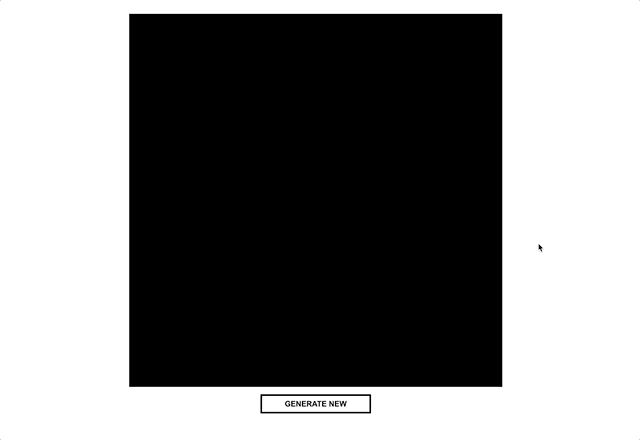

# Mondriaan meets CSS Grid & Vue
Randomized Mondriaan inspired art generated with Vue and CSS Grid. On each refresh or gerenerate new 'blocks' will be calculated with a random color assigned. The 'painting' is fully responsive.

## Preview


## Project setup
``` bash
# install dependencies
$ npm install # Or yarn install

# serve with hot reload at localhost:8080
$ npm run serve

# build for production
$ npm run build
```